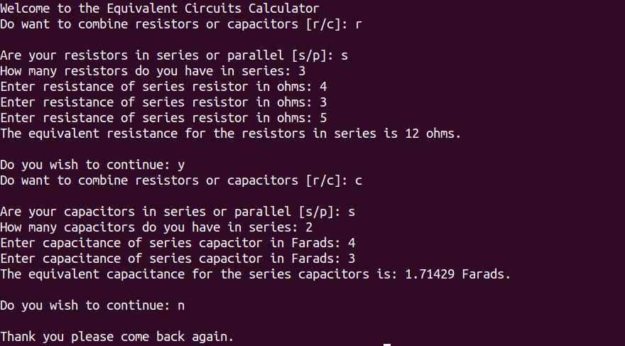

<h1> EquivalentCircuitsCalculator </h1>

Here is a C++ CLI program that enables the user to combine resistors or capacitors in series 
and parallel, when solving for equivalent circuits, without the need of having to open a 
calcualtor or write out any lengthy expressions. 

<figure>
  
  <figcaption style="font-style: italic; color:gray;padding: 2px; text-aling:center;">Demonstration of the Program Working as Intended</figcaption>
</figure>
 
 

<h2> How to Compile and Run in the Terminal</h2>
<ul>
  <li>Run <code>g++ main.cpp</code> </li>
  <li>Run <code>./a.out</code> to start program </li>
  <li>
    Answer the questions that pop up and enter the values of your resistors or capacitors to 
    combine them 
  </li>
  <li>
    Combine as many resistors and capacitors as you wish since the program persists until you type 
    &quot n &quot
  </li>
  <li>
    Thank you for your interest in the project and enjoy.
   </li> 
</ul>

<h3>Motivation for the Program</h3>
For both my electromagnetism physics course and circuits 1 course there’s a method of 
simplifying circuits called equivalent circuits. The reason we simplify is to fine what voltages 
are across components and what currents flow through them. Moreover, the method of equivalent 
circuits requires simplifying resistors with two techniques referred to as combing resistors 
in series and parallel. Combining resistors in series is simple since the expression is only 
the summation of two resistors as seen in Figure 1 below.

 
 
<figure>
  
  <figcaption style="font-style:italic; color:grey;padding: 2px; text-aling:center;">Illustration of calculations integrated into the program </figcaption>
</figure>
 
 

However for combing resistors in parallel the expression is more complex as seen in figure 2, 
so to save time from having to input these equations in the calculator I just made a C++ 
program to simplify them with only inputting the resistance of resistors. Also I made the 
calculator simplify capacitors since the process is similar except the equations are switched 
so capacitors in parallel is the same as combing resistors in series and vice versa. Lastly, 
since I do not want constantly run ./a.out to simplify components I just made while 
loop to ask me if I want to continue simplifying components.

